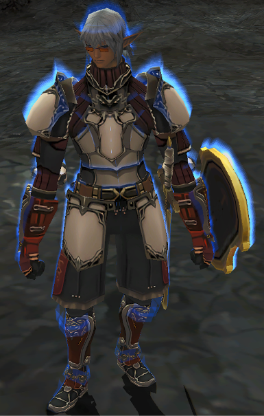
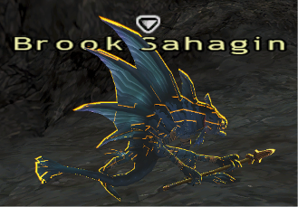
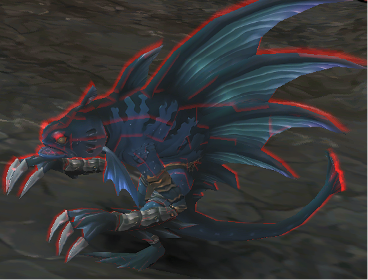

# targetaura

A self-contained **Ashita v4.3.1.2+** plugin that draws a category-coloured, depth-occluded **aura** directly on the
current target's 3D model a Fresnel rim-light, colour pulses and a sweep effect.

  

---

## Features
- **Per-target aura** on the model itself, coloured by category: Enemy (claimed / unclaimed), Claimed by Others, Claimed by yourself, Claimed by Party / Alliance, Party / Alliance Member, NPCS, Default
- **NM auto-detection**: Extracted Notorious Monster names from MobDB and integrated into the Plugin, no dependency on any data addon. NMs recieve a Special aura!
- **Watchlist**: Ability to highlight any target whose name matches your own list.
- **Looks**: Outline (rim) / Full glow / Fresnel rim-light; adjustable thickness, intensity, pulse, two-colour pulse and a scrolling *sweep* scan effect.
- **Self-contained**

## Screenshots

<table>
  <tr>
    <td align="center"> Unclaimed</td>
    <td align="center"> Claimed (self)</td>
  </tr>
</table>

## Install
1. Copy `targetaura.dll` into `...\plugins\`.
2. In-game: `/load targetaura`  (for auto-load, add `/load targetaura` to your Ashita boot script).

Settings are saved to `<Ashita>\config\targetaura.ini`.

---

## Troubleshooting
The plugin figures out which draw call belongs to your target from a stack signature at draw time. If a future
client update shifts that signature and the aura stops appearing (or bleeds onto nearby entities), run
**`/taura calibrate`** while a visible enemy is targeted, or tweak the **gate window** under *Advanced*.

## Building from source
Requires Visual Studio 2022 (x86 toolset) and the Ashita v4 plugin SDK (the folder containing `Ashita.h`).
1. Edit `src/build.bat` — set `VCVARS` to your `vcvars32.bat` and `ASHITA_SDK` to your Ashita SDK folder.
2. Run `src/build.bat` from a normal command prompt → it produces `targetaura.dll` (32-bit; PE machine `0x014C`).
3. Copy `targetaura.dll` into `...\plugins\`.

The NM list `src/nmnames.h` is generated from the mobdb dataset; regenerate it only if that data changes.

---

## Notes
- NM data is derived from the open **ThornyFFXI/mobdb** dataset and baked in at build time. The plugin needs no
  data files at runtime.
